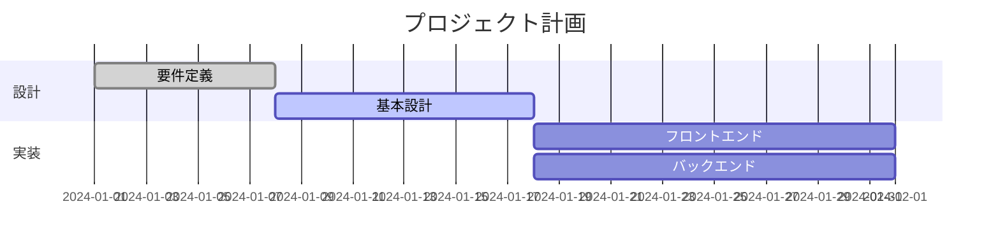

# Markdown マーメイドビジュアルエディタ

**Mermaid ガントチャートをリアルタイムにビジュアル編集できる VS Code 拡張機能です。**

コードを手書きせずに、ドラッグ＆ドロップでタスクを移動・リサイズ。ダブルクリックで名前を変更。右クリックで追加・削除。変更は即座に Mermaid コードへ反映されます。

---

## 機能一覧

### ガントチャートビジュアルエディタ

| 操作 | 方法 |
|------|------|
| パネルを開く | エディタタイトルバーのアイコン、またはコマンドパレット `Mermaid: Gantt エディタを開く`、または `Ctrl+Shift+G` |
| タスク移動 | バーをドラッグ |
| タスクリサイズ | バー右端のハンドルをドラッグ |
| タスク名編集 | バーまたはラベル列をダブルクリック |
| セクション名編集 | セクション名をダブルクリック |
| 追加 / 削除 / 順序変更 | 右クリックのコンテキストメニュー |
| タスク状態変更 | バー左端のインジケーターをクリック（`done` / `active` / `crit` / 未設定） |
| セクション開閉 | セクション行の `▼/▶` ボタン |
| タイムライン横スクロール | マウスホイール（通常スクロール） |
| タイムラインズーム | `Ctrl` + マウスホイール |
| タイムラインパン | タイムライン上をドラッグ |
| 元に戻す | `Ctrl+Z`、またはツールバー「↩ 元に戻す」 |
| 保存 | `Ctrl+S` |
| **依存関係設定** | 右クリック → 「⛓ 依存関係を設定」で依存元タスクを選択 |

### 依存関係（`after <id>`）

依存関係を設定すると、Mermaid の `after <id>` 構文でコードに反映されます。  
依存元タスクを移動すると、依存先の開始日も自動で追従します。  
バーを手動ドラッグすると依存関係は解除され、絶対日付に変換されます。

### スニペット

`.md` ファイルで `gantt` と入力すると、ガントチャートのテンプレートを補完挿入できます。

---

## 対応ファイル形式

- `.md` — Markdown ファイル内の ` ```mermaid ` ブロック
- `.mmd` — Mermaid 単体ファイル

---

## インストール

1. VS Code の拡張機能ビューで **"Mermaid"** を検索
2. **Markdown マーメイドビジュアルエディタ** をインストール
3. `.md` または `.mmd` ファイルを開き、タイトルバーのアイコンをクリック

---

## 使い方



上記のようなガントチャートブロックを含む Markdown ファイルを開き、エディタアイコンをクリックすると、ビジュアルエディタが横に表示されます。

---

## 要件

- VS Code 1.85.0 以上

---

## ライセンス

MIT — 詳細は [LICENSE.txt](LICENSE.txt) を参照してください。

---

## フィードバック・バグ報告

[GitHub Issues](https://github.com/Hashi-Kazu/vscode-mermaid-visual-editor/issues) までお寄せください。
