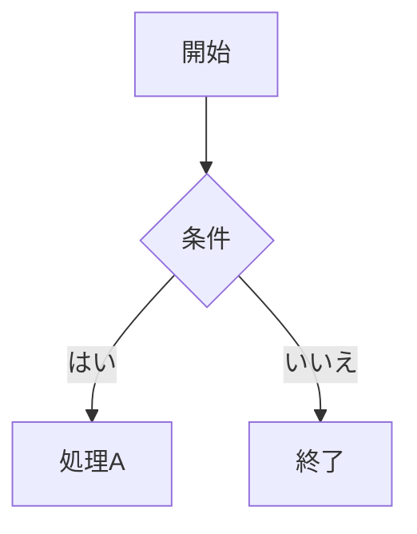
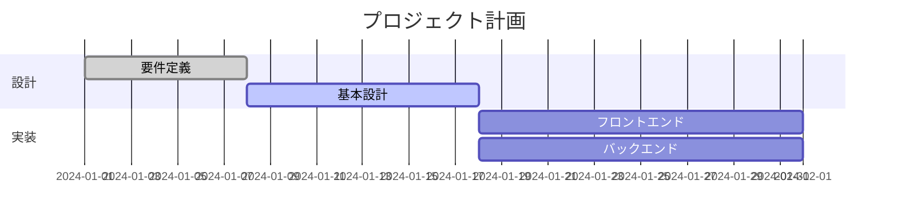

# Markdown マーメイドビジュアルエディタ

**Mermaid のガントチャート／フローチャートを、コードを手書きせずにビジュアル編集できる VS Code 拡張機能です。**

ドラッグ＆ドロップ・ダブルクリック・右クリックで編集すると、変更は即座に `.md` 内の Mermaid コードへ反映されます。

---

## 機能一覧

`.md` / `.mmd` を開くと、内容から **ガント** か **フローチャート** を自動判別してビジュアルエディタを開きます（判別できない場合は選択画面を表示）。ツールバーの「↔」で両エディタを切り替えられます。

### フローチャートエディタ

| 操作 | 方法 |
|------|------|
| パネルを開く | コマンドパレット `Mermaid: フローチャートエディタを開く`、または `Mermaid: Mermaidエディタを開く`（自動判別） |
| ノードのラベル編集 | ノードをダブルクリック |
| ノード追加 | ツールバー「＋ ノード追加」または空白をダブルクリック |
| ノード削除 | 右クリック →「✕ ノードを削除」、または選択して `Delete` |
| ノード形状変更 | 右クリック →「⬡ 形状を変更」（矩形 / 角丸 / ひし形 / スタジアム / 円） |
| エッジ追加 | ノードにホバーして現れるポートを別ノードへドラッグ |
| 新規エッジの既定線種 | ツールバー「既定エッジ」で選択（ビューア表示中のみ保持・MDには保存されません） |
| エッジのラベル編集 | エッジ線またはラベルをダブルクリック |
| エッジの線種変更 | 右クリック →「↔ スタイルを変更」（実線 / 点線 / 太線、矢印有無） |
| エッジ削除 | 右クリック →「✕ エッジを削除」、または選択して `Delete` |
| グラフ方向変更 | ツールバー「方向」（TD / LR / BT / RL） |
| パン / ズーム | 背景ドラッグでパン、マウスホイールでズーム |
| リセット（全体表示） | ツールバー「⊡ リセット」で全ノード・エッジを最大拡大＋中央表示 |
| SVG / PNG エクスポート | ツールバー「⬇ エクスポート」または右クリックメニュー |
| 元に戻す / 保存 | `Ctrl+Z` / `Ctrl+S` |

#### 記述ポリシー（遅延分離）

ノードを編集すると、対象ノードを単独宣言行（`A[ラベル]`）へ集約し、エッジは ID 参照のみ（`A --> B`）に整えます。標準 Mermaid 記法に沿いつつ、定義箇所を一意にして編集の不整合を防ぎます。手を付けていない既存行・サブグラフ・コメントは保持します。

### ガントチャートエディタ

| 操作 | 方法 |
|------|------|
| パネルを開く | コマンドパレット `Mermaid: Gantt エディタを開く`、または `Ctrl+Shift+G` |
| タスク移動 | バーをドラッグ |
| タスクリサイズ | バー右端のハンドルをドラッグ |
| タスク名編集 | バーまたはラベル列をダブルクリック |
| セクション名編集 | セクション名をダブルクリック |
| 追加 / 削除 / 順序変更 | 右クリックのコンテキストメニュー |
| タスク状態変更 | バー左端のインジケーターをクリック（`done` / `active` / `crit` / 未着手） |
| セクション開閉 | セクション行の `▼/▶` ボタン |
| タイムライン横スクロール | マウスホイール（通常スクロール） |
| タイムラインズーム | `Ctrl` + マウスホイール |
| タイムラインパン | タイムライン上をドラッグ |
| 元に戻す / 保存 | `Ctrl+Z`、ツールバー「↩ 元に戻す」 / `Ctrl+S` |
| **依存関係設定** | 右クリック → 「⛓ 依存関係を設定」で依存元タスクを選択 |

依存関係を設定すると Mermaid の `after <id>` 構文で反映され、依存元の移動に依存先が追従します。バーを手動ドラッグすると依存関係は解除され絶対日付へ変換されます。

### スニペット

`.md` ファイルで `gantt` と入力すると、ガントチャートのテンプレートを補完挿入できます。

---

## 対応ファイル形式

- `.md` — Markdown ファイル内の ` ```mermaid ` ブロック
- `.mmd` — Mermaid 単体ファイル

---

## インストール

1. VS Code の拡張機能ビューで **"Mermaid"** を検索
2. **Markdown マーメイドビジュアルエディタ** をインストール
3. `.md` または `.mmd` ファイルを開き、タイトルバーのアイコンをクリック

---

## 使い方

### フローチャート



### ガントチャート



上記のようなブロックを含むファイルを開き、エディタアイコンをクリックするとビジュアルエディタが横に表示されます。

---

## 要件

- VS Code 1.85.0 以上

---

## ライセンス

MIT — 詳細は [LICENSE.txt](LICENSE.txt) を参照してください。

---

## フィードバック・バグ報告

[GitHub Issues](https://github.com/Hashi-Kazu/vscode-mermaid-visual-editor/issues) までお寄せください。
