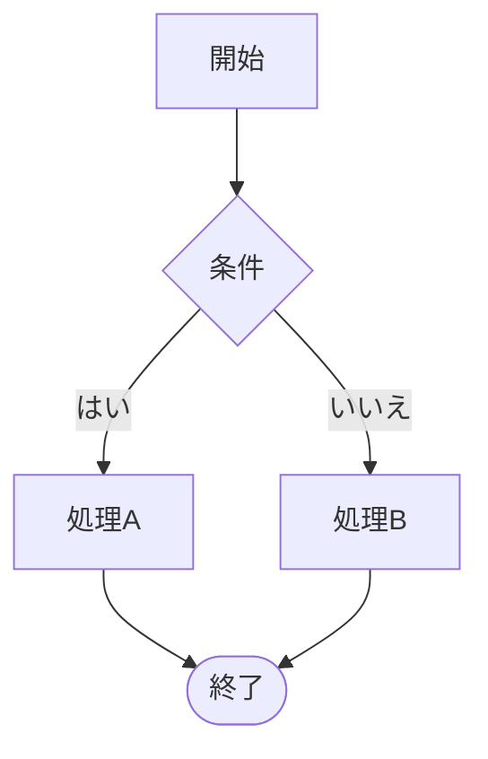

# フローチャート サンプル

Ctrl+Shift+F（または「フローチャートエディタを開く」コマンド）でビジュアルエディタを開けます。

```mermaid
flowchart TD
    A[開始]
    B{条件}
    C[処理A]
    D[処理B]
    E([終了])
    A --> B
    B -->|はい| C
    B -->|いいえ| D
    C --> E
    D --> E
```
