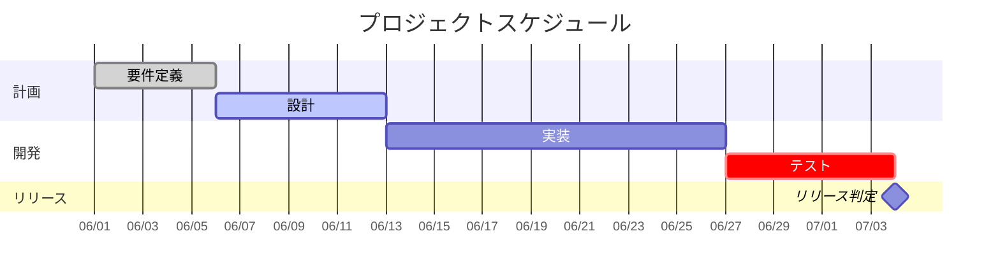

# ガントチャート サンプル

Ctrl+Shift+G（または「Ganttエディタを開く」コマンド）でビジュアルエディタを開けます。

```mermaid
gantt
    title プロジェクトスケジュール
    dateFormat YYYY-MM-DD
    axisFormat %m/%d

    section 計画
        要件定義 :done, t1, 2026-06-01, 5d
        設計     :active, t2, after t1, 7d

    section 開発
        実装     :t3, after t2, 14d
        テスト   :crit, t4, after t3, 7d

    section リリース
        リリース判定 :milestone, m1, after t4, 0d
```
